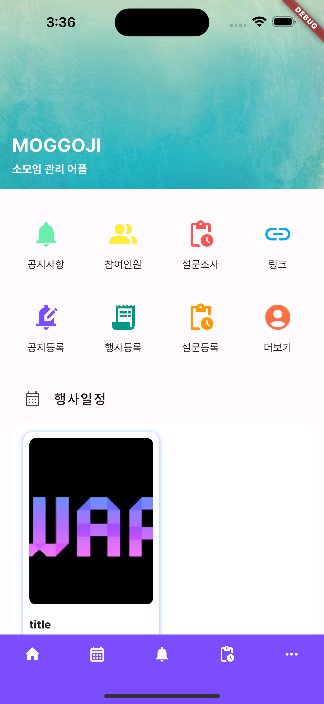
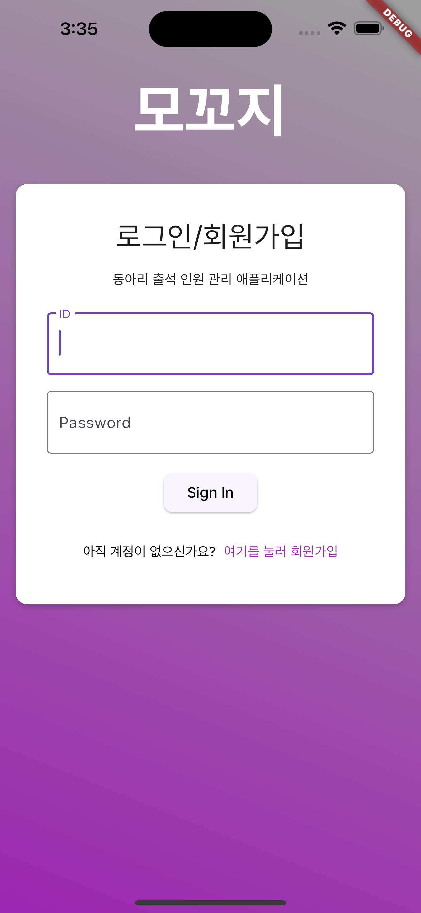
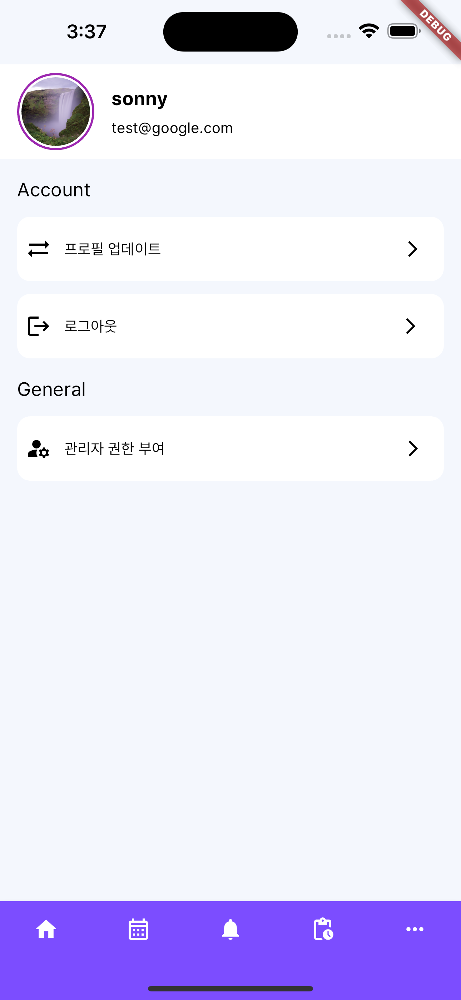
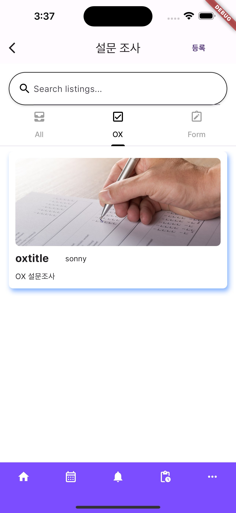
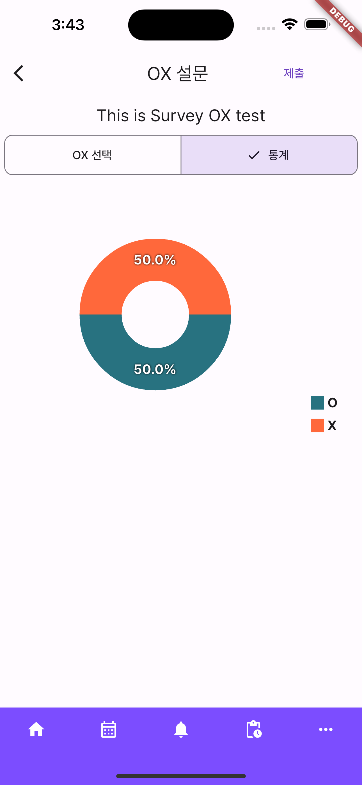
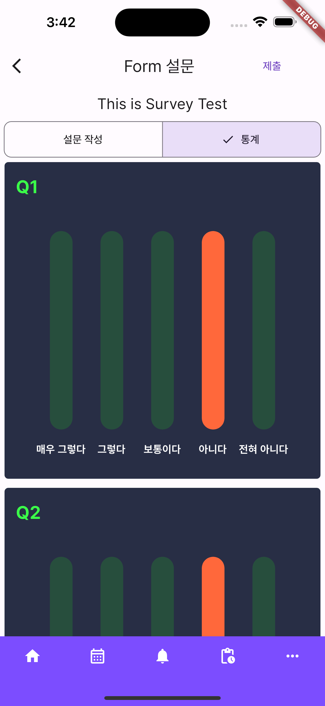
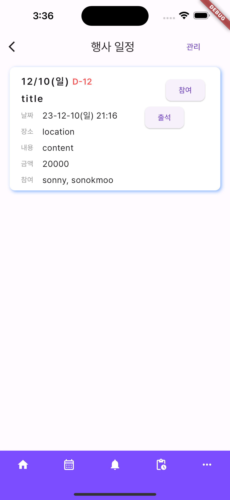
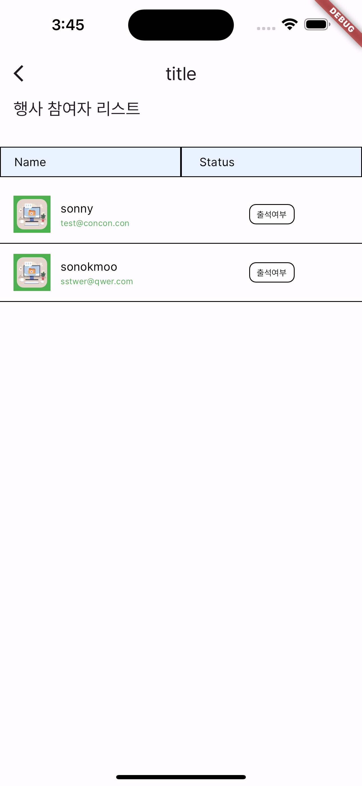
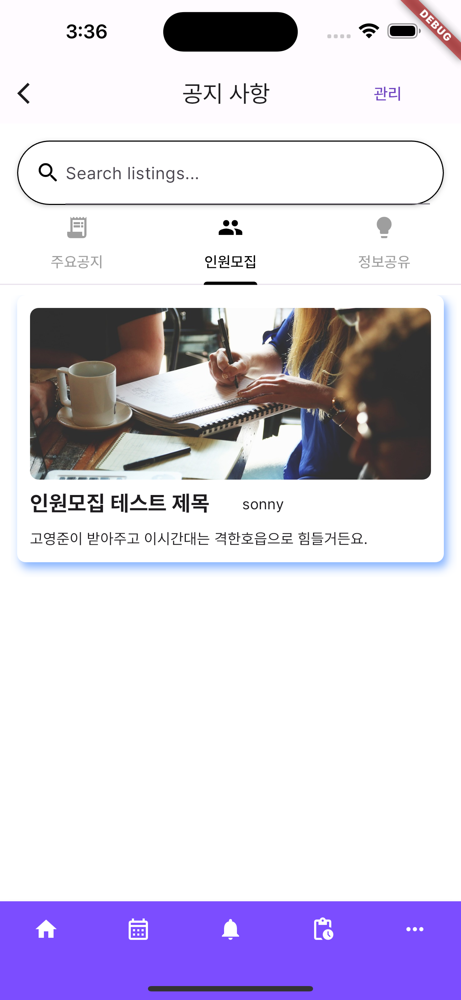

# moggoji

- 동아리 출석 인원 관리 애플리케이션

## - Stack

 

 

## - Contributors
<table>
  <tr>
    <td align="center">
      <a href="https://github.com/DevDanielNAM" target="_blank">
        
         
        <a href="https://github.com/pknu-wap/2023_2_APP_MOGGOJI/commits/main?author=DevDanielNAM" title="Code">DevDanielNAM </a>
    </td>
    <td align="center">
      <a href="https://github.com/merryiscute" target="_blank">
        
         
        <a href="https://github.com/pknu-wap/2023_2_APP_MOGGOJI/commits/main?author=merryiscute" title="Code">merryiscute </a>
    </td>
    <td align="center">
      <a href="https://github.com/okdoittttt" target="_blank">
        
         
        <a href="https://github.com/pknu-wap/2023_2_APP_MOGGOJI/commits/main?author=okdoittttt" title="Code">okdoittttt </a>
    </td>
    <td align="center">
      <a href="https://github.com/Greenmung" target="_blank">
        
         
        <a href="https://github.com/pknu-wap/2023_2_APP_MOGGOJI/commits/main?author=Greenmung" title="Code">Greenmung </a>
    </td>
  </tr>
  <tr>
    <td align="center">남기성</td>
    <td align="center">유예준</td>
    <td align="center">손옥무</td>
    <td align="center">주현주</td>
  </tr>
    <tr>
    <td align="center">Flutter</td>
    <td align="center">Flutter</td>
    <td align="center">Spring Boot | Flutter</td>
    <td align="center">Spring Boot</td>
  </tr>
</table>

## - Outline
단수의 모임을 관리할 수 있는 어플리케이션. 어플리케이션 가입자는 쉽게 일정을 관리하고 공유할 수 있습니다.
공지사항, 출석, 설문조사 등 다양한 기능을 통해 편리하게 모임을 관리할 수 있습니다.

### 주요 기능
- 출석체크
- 설문조사
- 공지사항

## - Directory structure

### Client
    .
    ├── lib
    │   ├── common
    │   ├── items
    │   ├── main.dart
    │   ├── models
    │   ├── pages
    │   │   ├── detail
    │   ├── resources
    │   └── service

### Server
    .
    ├── MoggojiServerApplication.java
    ├── configuration
    ├── controller
    ├── exception
    ├── model
    │   └── request
    ├── repository
    ├── service
    └── utils

### - UI

    
    
        
    
    
        
    
    

